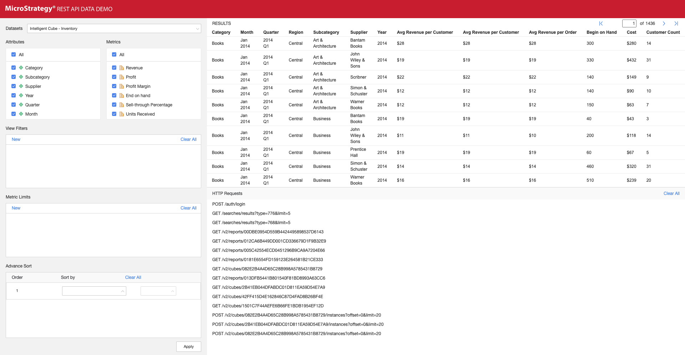

# MicroStrategy REST API Data Demo
Contains the code of the React app that demonstrates the capabilities of the MicroStrategy REST Data APIs. This Demo was created using a [Create React App](https://facebook.github.io/create-react-app/docs/getting-started).

View [the live demo](https://microstrategy.github.io/data-api-demo/site/).

## Description
This App is a sample demo app to show the users how to use MicroStrategy REST Data APIs to execute cubes and reports while enabling features like filtering, sorting, and application of metric limits on the data for the V2 data endpoints.

A list of REST APIs were used in the demo. The workflow of API endpoints used for the demo includes authenticating the user, searching and fetching datasets, creating new instances of the reports and cubes, displaying the filtered/sorted data from those cubes and reports.  

## REST APIs Used

#### POST /auth/login 
Creating a MicroStrategy session given credentials and authentication mode. An authToken will be returned for later operations.
In the demo, this API was used to create a configuration session.

#### GET/searches/results
Search and fetching the objects of a specific type. 
In the demo, this API was used to fetch the objects of type report grid and report cube with a limit of 5.

#### GET /v2/cubes/{cubeId}
Get the definition of a specific cube, including attributes and metrics.
In the demo, this API was used to fetch definitions of 3 report cubes that were populated in the datasets.

#### GET /v2/reports/{reportId}
Get the definition of a specific report, including attributes and metrics.
In the demo, this API was used to fetch definitions of 4 report grids that were populated in the datasets.

#### POST /v2/cubes/{cubeId}/instances?offset=0&limit=20
Creating a new instance of a specific cube. This in-memory instance can be used by other subsequent requests.
In the demo, this API was used to create a new instance of the data in the cube chosen in the dataset dropdown. The body of this request can accept values for performing filtering operations:

```javascript
{
  "viewFilter": {
    "operator": "And",
    "operands": [
      {
        "operator": "In",
        "operands": [
          {
            "type": "attribute",
            "id": "8D679D3511D3E4981000E787EC6DE8A4",
            "name": "Call Center"
          },
          {
            "type": "elements",
            "elements": [
              {
                "name": "Memphis",
                "id": "8D679D3511D3E4981000E787EC6DE8A4:15"
              }
            ]
          }
        ]
      }
    ]
  },
  "metricLimits": {
    "4C051DB611D3E877C000B3B2D86C964F": {
      "operator": "And",
      "operands": [
        {
          "operator": "Greater",
          "operands": [
            {
              "type": "metric",
              "id": "4C051DB611D3E877C000B3B2D86C964F",
              "name": "Profit"
            },
            {
              "type": "constant",
              "dataType": "Real",
              "value": "1000"
            }
}
```

This POST creates a returns an `instanceId` which is a new resource, which populates the grid in the demo with the data filtered with an attribute name Memphis and a metric limit on Profit greater than 1000. A similar request is made on a report grid with the endpoint POST /v2/reports/{reportId}/instances?offset=0&limit=20

## Customizing and Deploying this App
1. Download or clone this repo.
1. `cd client`
1. Run `npm install`.
1. Change the library URL in src/config.js, to point to your MicroStrategy Library, with the correct login credentials and verify REST server configuration.
1. Run `npm run build`. The build result files are under the build directory. (Note: Change the relative path of api_demo_icon.svg, if it is not deployed to root folder.)
1. Alternatively, run `npm start` to debug the application.

## Configure the Sample

The config.js file is used to configure the sample for your environment. Set values for the following variables to configure the Intelligence Server, project, folder, user credentials, and number of documents to display on the page.

| Variable name | Variable description |
|:-------------|:------------------|
| restServerURL | Base URL of the REST API. For example, http://localhost:8080/MicroStrategyLibrary/api. The REST API endpoints will be appended to this base URL. |
| projectId | ID of the MicroStrategy project that will be used by the REST API endpoints. For example, "B19DEDCC11D4E0EFC000EB9495D0F44F". |
| username | Username that will be authenticated. |
| password| Password for username that will be authenticated. |
| itemPerPage | Number of items the table will display per page |
| cubes | Array of cube IDs. These cubes are listed in the Datasets panel on the left of the sample, under Cubes. Be sure to use valid cube IDs. For more information, see [Supported Features](https://www2.microstrategy.com/producthelp/CURRENT/RESTSDK/Content/topics/REST_API/REST_API_REST_Data_API_SupportedFeatures.htm).|
| reports | Array of report IDs. These reports are listed in the Datasets panel on the left of the sample, under Reports. Be sure to use valid report IDs. For more information, see [Supported Features](https://www2.microstrategy.com/producthelp/CURRENT/RESTSDK/Content/topics/REST_API/REST_API_REST_Data_API_SupportedFeatures.htm). |
| datasets | Array of reports or cubes to be shown by default. |

## Use the Sample

Initially, the demo displays a list of cubes and reports in the panel on the left. Users select a cube or report from the list.

Once users have made a selection, the attributes and metrics for the selected cube or report are displayed in the panel below and a data table is displayed in the panel on the right. By default, all the attributes and metrics are shown initially, but users can select specific attributes or metrics and apply them manually.

Below the attributes, users are given the option to apply view filters. This demo supports two kinds of view filters: element filter and attribute form filter. Users define a filter, click **New**, and then click Apply. The data displayed is filtered as soon as the view filter is applied.

Users can also see the raw JSON result by clicking the icon above the data table, and they can page through the previous and next pages using the left and right arrows.




The rest part is generated automatically by Create React App.

## Available Scripts

In the project directory, you can run:

### `npm start`

Runs the app in the development mode.

Open [http://localhost:3000](http://localhost:3000) to view it in the browser.

The page will reload if you make edits.

You will also see any lint errors in the console.

### `npm test`

Launches the test runner in the interactive watch mode.

See the section about [running tests](https://facebook.github.io/create-react-app/docs/running-tests) for more information.

### `npm run build`

Builds the app for production to the `build` folder.

It correctly bundles React in production mode and optimizes the build for the best performance.

The build is minified and the filenames include the hashes.

Your app is ready to be deployed!

See the section about [deployment](https://facebook.github.io/create-react-app/docs/deployment) for more information.

### `npm run eject`

**Note: this is a one-way operation. Once you `eject`, you can’t go back!**

If you aren’t satisfied with the build tool and configuration choices, you can `eject` at any time. This command will remove the single build dependency from your project.

Instead, it will copy all the configuration files and the transitive dependencies (Webpack, Babel, ESLint, etc) right into your project so you have full control over them. All of the commands except `eject` will still work, but they will point to the copied scripts so you can tweak them. At this point you’re on your own.

You don’t have to ever use `eject`. The curated feature set is suitable for small and middle deployments, and you shouldn’t feel obligated to use this feature. However we understand that this tool wouldn’t be useful if you couldn’t customize it when you are ready for it.

## Learn More

You can learn more in the [Create React App documentation](https://facebook.github.io/create-react-app/docs/getting-started).

To learn React, check out the [React documentation](https://reactjs.org/).

### Troubleshooting

In case of CORS (Cross-origin resource sharing) error, make sure that the MicroStrategy Library CORS settings allow requests from the hosting domain of this demo. These settings can be updated in the [Library Admin Page's Security Settings.](https://www2.microstrategy.com/producthelp/Current/InstallConfig/en-us/Content/library_admin_control_panel.htm).  

To enable CORS for the Library Server:

1. Open the Library Admin page. Your URL should be similar to the following:

    ```
    https://<host_name>:<port>/MicroStrategyLibrary/admin
    ```

1. Navigate to Library Server -> Security Settings.
1. Choose the appropriate setting for *Allow Library embedding in other sites* to reconfigure CORS.
